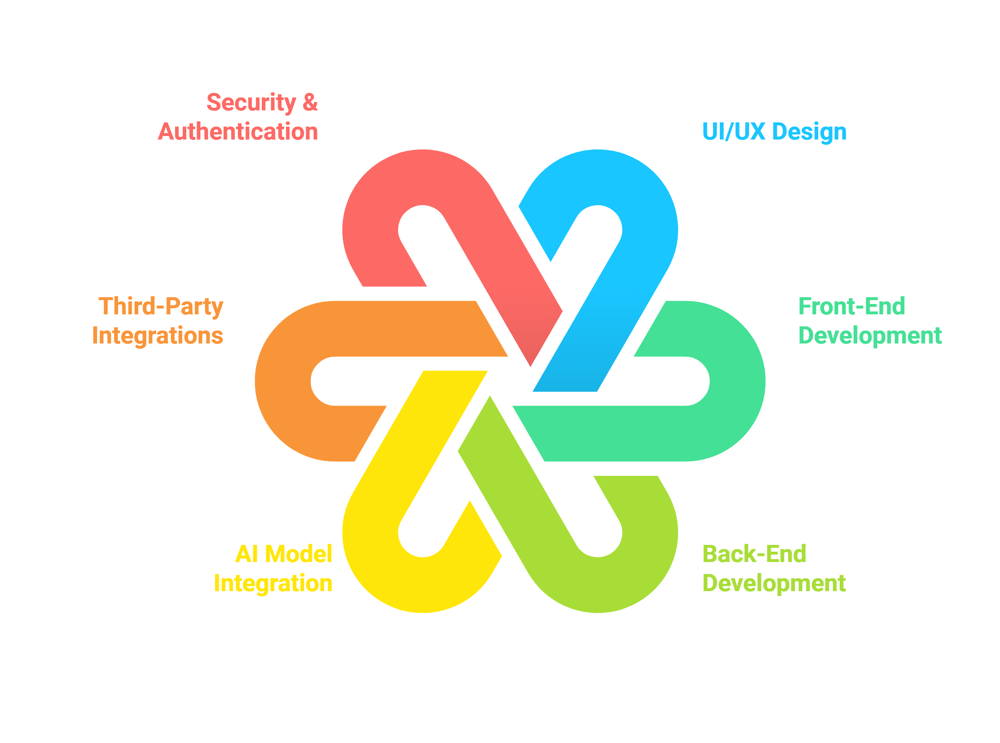

---

## 📖 Core Features

### Recipe Sharing and AI Integration
Users can share recipes and receive suggestions based on ingredients they have.

### Personalization
AI-powered recipe recommendations tailored to user preferences and available ingredients.

### User Interaction and Engagement
Comments, ratings, and social sharing options for recipes.

### Recipe Management and Categorization
Recipes sorted by categories for easy navigation and searchable by ingredients or name.

### Preferred Recipes
Users can mark recipes as favorites.

### Admin Panel
Admins can manage content, user activities, and platform operations.

### Monetization
Integrated ads for revenue.

### Security and Authentication
Secure user login and data protection features.

---

## 📐 Development Scope

### UI/UX Design
User-centric interface design focused on ease of use and intuitive navigation.

### Front-End Development
Responsive and interactive front end built for a smooth user experience.

### Back-End Development
Efficient management of users, recipes, and data with robust data storage.

### AI Model Integration
Custom AI algorithms for personalized recipe suggestions based on available ingredients.

### Third-Party Integrations
Ad integration and other relevant APIs.

### Security & Authentication
Implementation of secure login and data protection measures.

### Testing & QA
Comprehensive testing for functionality, security, and user experience.

---

## 💵 Estimated Cost and Timeline

### 📅 Total Estimated Cost
Total Project Budget: $1,500 - $2,000

### Development Timeline
Approximately 3-6 months, considering design, development, testing, and deployment.

---

