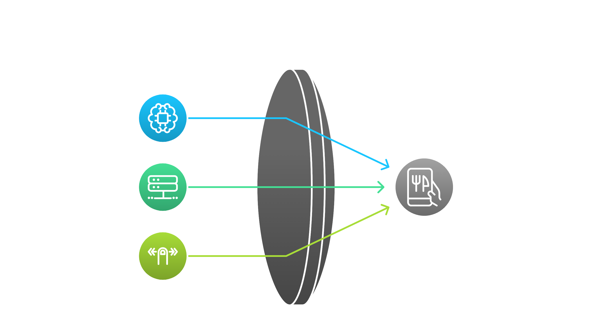
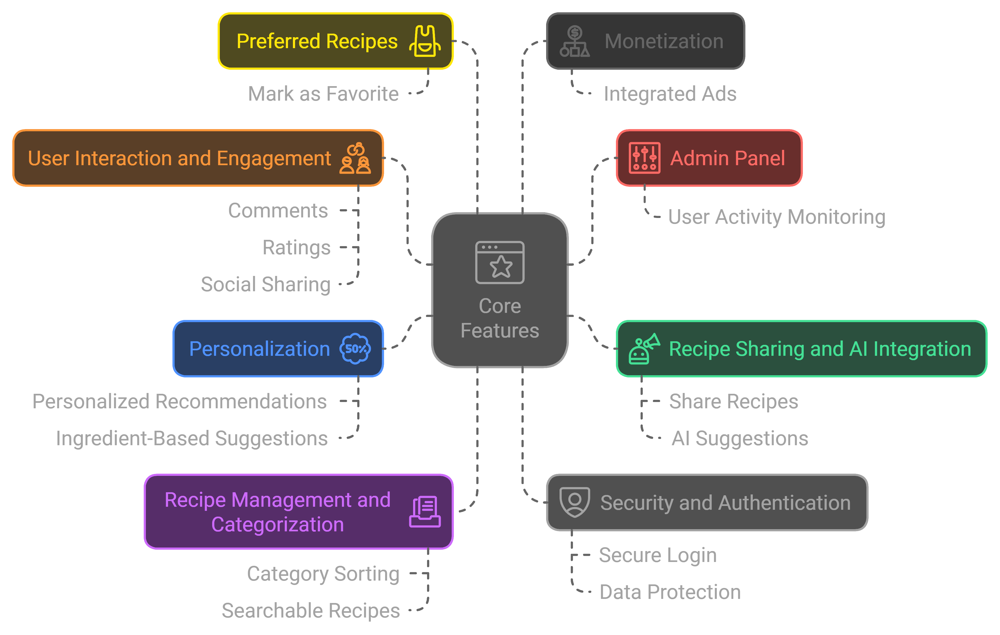
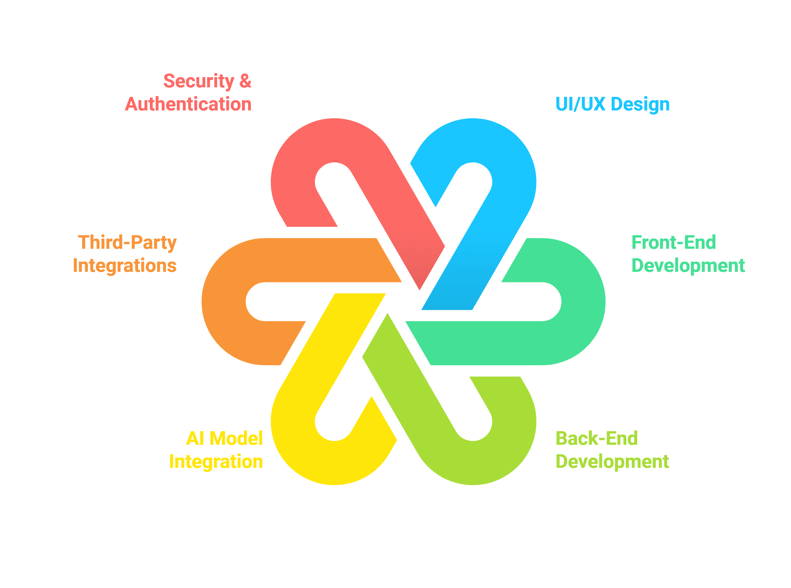
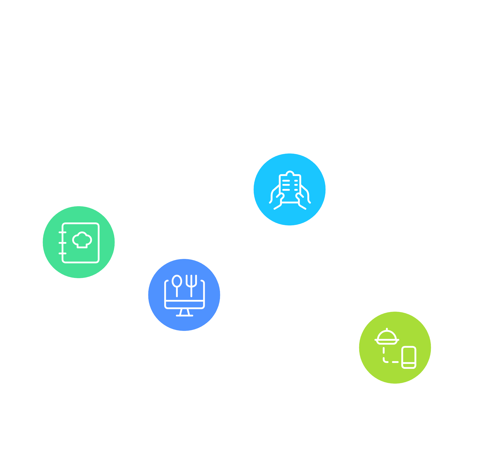
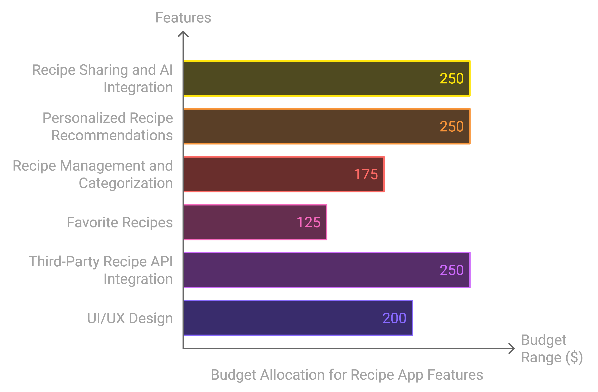
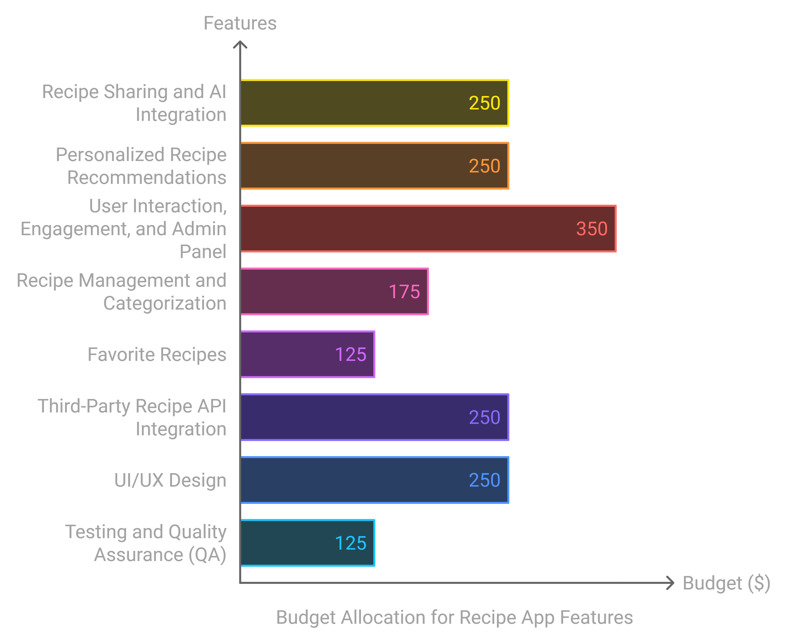
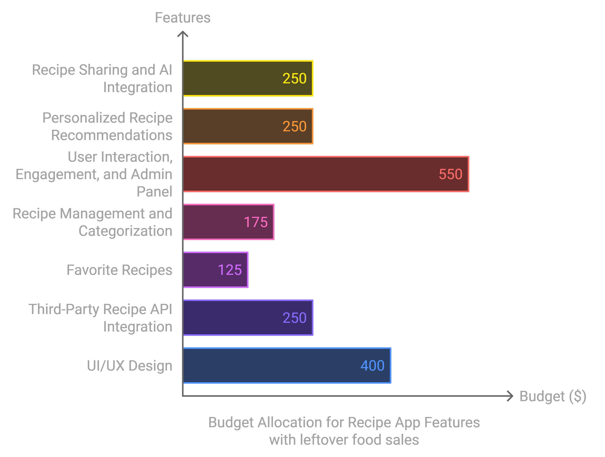

---

## 📖 Core Features

### Recipe Sharing and AI Integration
Users can share recipes and receive suggestions based on ingredients they have.

### Personalization
AI-powered recipe recommendations tailored to user preferences and available ingredients.

### User Interaction and Engagement
Comments, ratings, and social sharing options for recipes.

### Recipe Management and Categorization
Recipes sorted by categories for easy navigation and searchable by ingredients or name.

### Preferred Recipes
Users can mark recipes as favorites.

### Admin Panel
Admins can manage content, user activities, and platform operations.

### Monetization
Integrated ads for revenue.

### Security and Authentication
Secure user login and data protection features.

---

## 📐 Development Scope

### UI/UX Design
User-centric interface design focused on ease of use and intuitive navigation.

### Front-End Development
Responsive and interactive front end built for a smooth user experience.

### Back-End Development
Efficient management of users, recipes, and data with robust data storage.

### AI Model Integration
Custom AI algorithms for personalized recipe suggestions based on available ingredients.

### Third-Party Integrations
Ad integration and other relevant APIs.

### User Interaction, Engagement, and Admin Panel
  Description: Provides a secure user login, as well as features like comments, ratings, and an admin panel for managing content and user activities.

### Testing & QA
Comprehensive testing for functionality, security, and user experience.

---
## Business Case: Leftover Food Sales integration
### Objective
To reduce food waste by providing a platform where restaurants can sell leftover food at discounted rates at the end of each day.
### How It Works

- Restaurants list unsold food items at discounted prices near closing time.
- Customers can browse the app to view available leftover food items nearby.
- They can reserve and pay for items through the app, then pick them up at the restaurant.
### Value Proposition:
- Restaurants: Reduce food waste, earn additional revenue, and increase customer outreach.
- Customers: Access discounted food items, support sustainability efforts, and discover new dining options affordably.
## Features
- Restaurant Dashboard: Allows restaurants to list leftover items, set prices, and update 
  availability.
- Customer Role Allows customers to search for food items and reserve items.
---
## 💵 Estimated Cost and Timeline

### 📅 Total Estimated Cost without auth and user engaigment 
Total Project Budget: $ 600 - $ 1000

### 📅 Total Estimated Cost with auth and user engaigment
Total Project Budget: $1,500 - $2,000

### 📅 Total Estimated Cost with auth and leftover food sales 
Total Project Budget: $2,500 - $3,000

### Development Timeline
Approximately 3-6 months, considering design, development, testing, and deployment.

---

